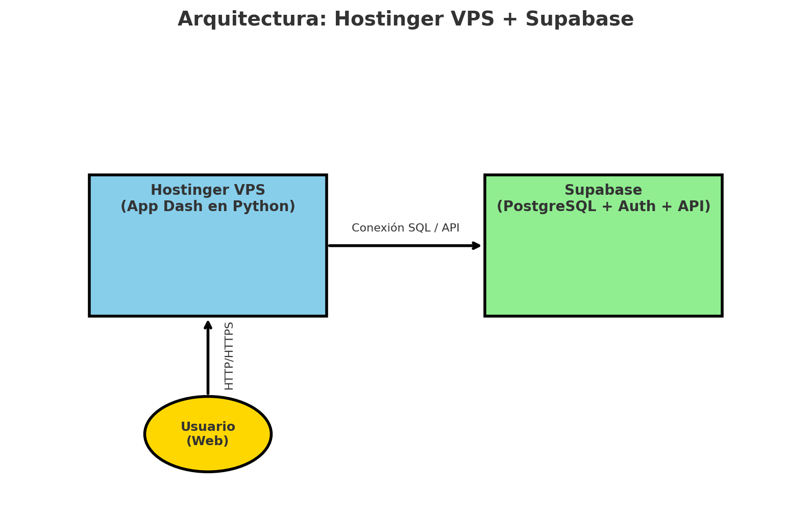

# Proyecto de Aprovisionamiento Predictivo

Este proyecto en Python (Dash + Supabase) busca analizar y predecir la demanda 
de productos en la venta por catálogo en Guatemala.

## Arquitectura: Hostinger VPS + Supabase

- 🟦 Hostinger VPS: donde corre tu aplicación Dash en Python.
- 🟩 Supabase: gestiona la base de datos PostgreSQL, autenticación y API.
- 🟨 Usuario Web: accede a la app por HTTP/HTTPS.
- ➡️ El VPS se conecta a Supabase vía SQL o API.

